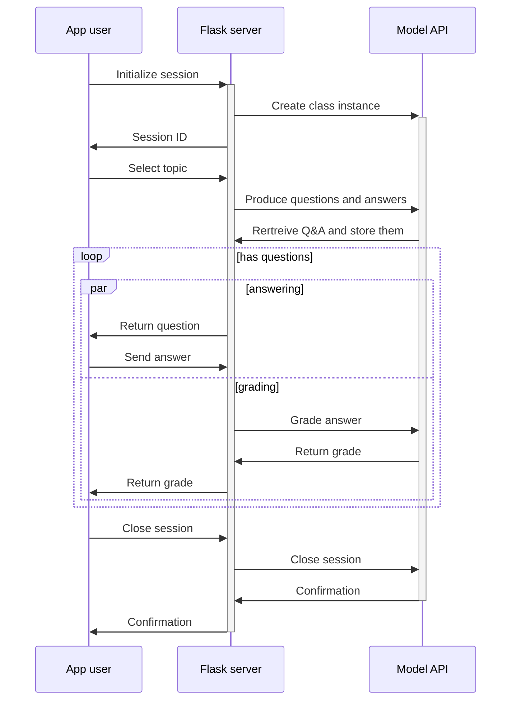

# Information Retrieval

> A humble learning assistant made with LLAMA.

Project is created for an exam druing the university course Information Retrieval.

## Sequence of component interactions

## To use API

To test the API for the web application, you can use [Bruno](https://www.usebruno.com/) as a simple,
Postman-like API testing tool. The Bruno collection is located in the [bruno/](./bruno/) directory.

## Authors

- Dušan Simić <dusan.simic@dmi.uns.ac.rs>
- Vladimir Kovačević <vladimir.kovacevic@dmi.uns.ac.rs>

## License

[BSD 2-clause](./LICENSE)
