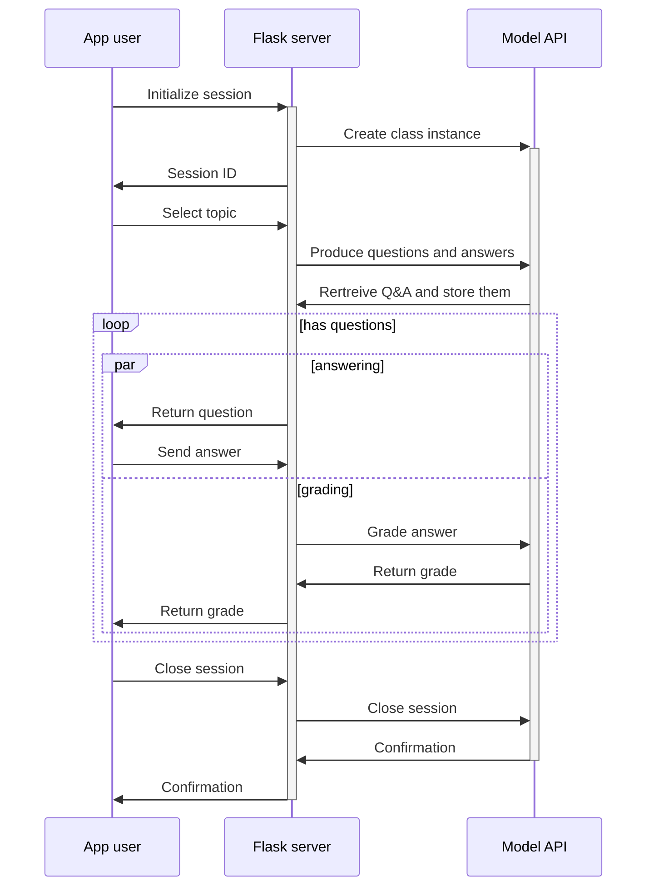

# AIearner

<p align="center">

</p>

> A humble learning assistant made with LLAMA.

Project is created for an exam druing the university course Information Retrieval.

## Sequence of component interactions



## Deploy the app

To quickly and simply deploy the app, you can use Docker Compose.

```sh
docker compose up
```

To start running it in the background, you can use the `-d` options (for detach).

```sh
docker compose up -d
```

## Running server

To run the API server, just run the following command. To see which versions of packages are
expected, check out the Conda [environment.yml](./dalai/environment.yml).

```sh
python -m flask --app dalai/main.py run --no-debugger --no-reload
```

Another option is to use VSCode debugging tool and run the server with `debug: flask server`
launcher.

## Running the web app

First pull latest image from GitHub container registry.

```sh
docker pull ghcr.io/dusansimic/ir-proj/front:latest
```
Then start the container with the following command. It will start the container in background with
an option to automatically remove it once it stops. It will start the web app on port 8080.

```sh
docker run --rm -d -p 8080:80 ghcr.io/dusansimic/ir-proj/front:latest
```

To stop the container first find the container name.

```sh
docker ps
```

And then stop it by entnering it's name in the stop command.

```sh
docker stop <container name>
```

## Development

To work on the backend, you can use the same command for running the server (explained above) or
through VSCode run the `debug: flask server` launcher.

For the web app, you'll need Node.js (version 22) was used during development. Since the web app is
located in the front directory, you'll need to change your current directory to it before taking any
other steps.

To test the app you can run the development server with the `dev` npm script.

```sh
npm run dev
```

When you would like to build the app, simply run the `build` npm script.

```sh
npm run build
```

## To use API

To test the API for the web application, you can use [Bruno](https://www.usebruno.com/) as a simple,
Postman-like API testing tool. The Bruno collection is located in the [bruno/](./bruno/) directory.

## Authors

- Dušan Simić <dusan.simic@dmi.uns.ac.rs>
- Vladimir Kovačević <vladimir.kovacevic@dmi.uns.ac.rs>

## Demo

[](https://drive.google.com/file/d/1iPR7w2KdutQkFXDoR0YyUX-fUCGRB2_N/view?usp=share_link)

## License

[BSD 2-clause](./LICENSE)
